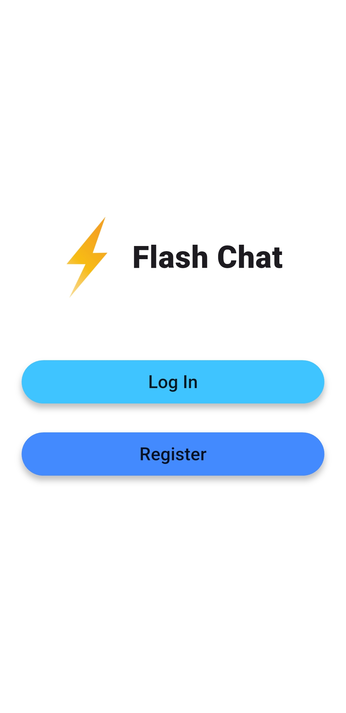
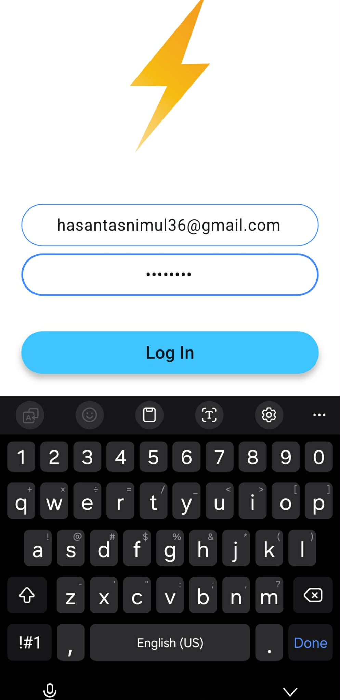
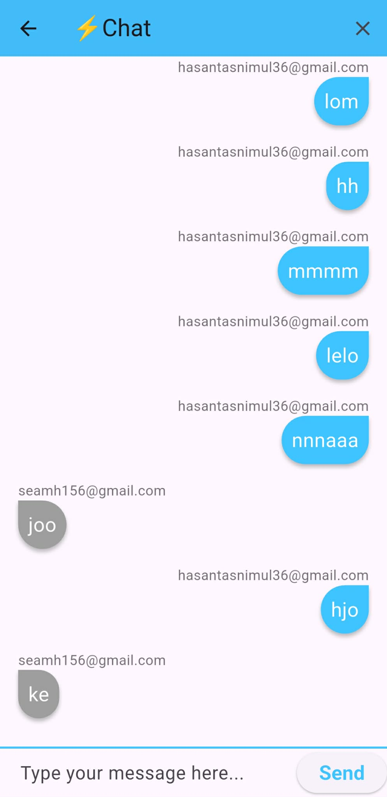

# Flash Chat - Flutter

Flash Chat is a simple real-time chat application built with Flutter and Firebase. It demonstrates user authentication (email/password) and real-time messaging using Cloud Firestore. This repo is a learning/example project based on the classic "Flash Chat" Flutter tutorial.

## Table of Contents

- **Description**: What this app does
- **Screenshots**: Preview images (placeholders included)
- **Features**: App features
- **Tech Stack**: Libraries and services used
- **Prerequisites**: Tools to install
- **Setup**: How to get the project running locally
- **Firebase**: Quick Firebase notes
- **Project Structure**: Key files and folders
- **Contributing**: How to help
- **Contact**: Author

## Description

This project provides a minimal chat application where users can register, log in, and exchange messages in real time. It is intended as a learning project or starting point for a more complete chat app.

## Screenshots

> NOTE: The repository includes image placeholders below. Copy the four screenshots you provided into the folder `images/screenshots/` and name them exactly as shown so that Markdown will render them in this README.

- `images/preview1.png` - Welcome / Home screen (buttons)
- `images/preview2.png` - Registration screen with inputs
- `images/preview3.png` - Login/keyboard view
- `images/preview4.png` - Chat screen (messages)

Once you add the images, they will appear here:

<table>
  <tr>
    <td align="center">
      <br/>
      <b>Welcome Screen</b>
    </td>
    <td align="center">
      <br/>
      <b>Register Screen</b>
    </td>
    <td align="center">
      <br/>
      <b>Login Screen</b>
    </td>
    <td align="center">
      <br/>
      <b>Chat Screen</b>
    </td>
  </tr>
</table>

## Features

- **Email/password authentication** (Firebase Auth)
- **Real-time messaging** with Cloud Firestore
- Clean, simple UI with rounded input fields and message bubbles
- Basic message list with sender display

## Tech Stack

- Flutter (Dart)
- firebase_auth (Firebase Authentication)
- cloud_firestore (Cloud Firestore)

Check `pubspec.yaml` for exact dependency versions used in this project.

## Prerequisites

- Flutter SDK installed and on your PATH (stable channel recommended)
- A Firebase project and configuration (see Firebase section)
- An Android/iOS emulator or physical device

## Setup (Local)

1. Clone the repository:

```powershell
git clone https://github.com/tasnimul1331/Flash-Chat-App-in-Flutter.git
cd "Flash Chat"
```

2. Install dependencies:

```powershell
flutter pub get
```

3. Add the screenshots (optional, for README preview):

Place the four screenshot image files into `images/screenshots/` and name them:

```
images/preview1.png
images/preview2.png
images/preview3.png
images/preview4.png
```

4. Configure Firebase (see below)

5. Run the app:

```powershell
flutter run
```

## Firebase Notes

This app expects Firebase to be configured for the appropriate platforms.

- Android: make sure `android/app/google-services.json` is present.
- iOS: make sure `ios/Runner/GoogleService-Info.plist` is present.

The `android/app/google-services.json` is already present in this repo (check `android/app/`). If you want to use your own Firebase project, replace that file and the iOS plist with files from your Firebase console and enable Email/Password authentication and a Cloud Firestore database.

Security: This example uses simple Firestore rules for learning. Do not use permissive rules in production.

## Project Structure

- `lib/main.dart` — App entry point and route setup
- `lib/constants.dart` — Shared constants
- `lib/components/rounded_button.dart` — Reusable rounded button widget
- `lib/screens/welcome_screen.dart` — Welcome page with Login/Register
- `lib/screens/login_screen.dart` — Login flow
- `lib/screens/registration_screen.dart` — Registration flow
- `lib/screens/chat_screen.dart` — Main chat UI and message stream

Explore the `lib/` folder to see how authentication and Firestore calls are wired.

## Contributing

Contributions are welcome. Open an issue or submit a pull request. Keep changes focused and add tests if applicable.

## Contact

Author: tasnimul1331

---

If you want, I can also add the four screenshot files into `images/screenshots/` if you provide the image files (or confirm you'd like me to create placeholders). After that I can run simple checks and show how the README renders locally.
